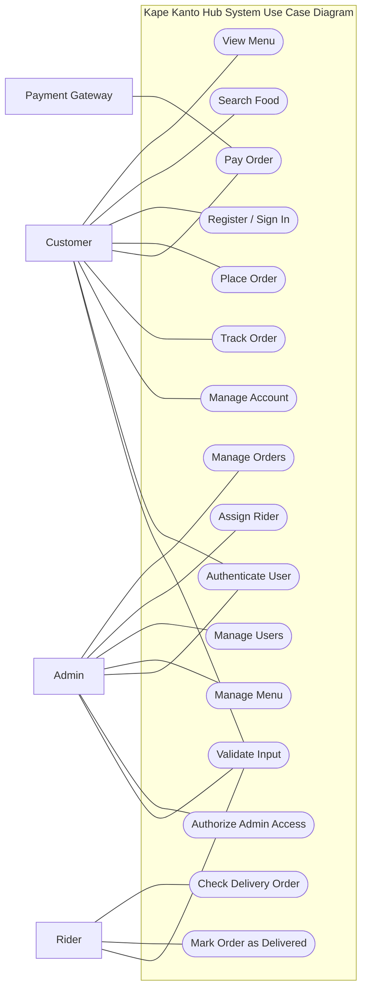

# Kape Kanto Hub Use Case Diagram

This version is closer to the sample image:
- actors are outside the system box
- use cases are inside the system box
- lines only show who can do each action
- it does not mean the actions must happen in that exact order
- simple security use cases are also included

## Actors

- Customer
- Admin
- Rider
- Payment Gateway

## Use Case Diagram

## Short Explanation

- Customer can view the menu, search food, sign in, place an order, pay, track the order, and manage account details
- Admin manages orders, assigns riders, manages users, and manages menu items
- Rider checks delivery orders and marks them as delivered
- Payment Gateway is used when the customer pays for the order
- Security is shown through user sign in, admin-only access, and input checking
